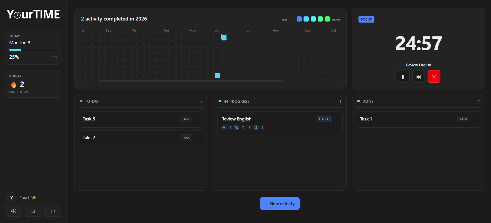

<h1 align="center">YourTime</h1>

<p align="center">
  <strong>Plan your day. Master your focus. Build your streak.</strong><br>
  A visual productivity and habit-tracking SPA that combines a dynamic Kanban,
  an automatic Pomodoro and a yearly consistency heatmap — all in one dark-mode web app.
</p>

<p align="center">
  <a href="https://yourtimeapp.me"></a>
  
  
  
  
  
  
</p>

---

## Live demo

**[yourtimeapp.me](https://yourtimeapp.me)** — Currently free and open to new users.



---

## What it does

YourTime turns daily discipline into a visual, interactive experience. It's built around three tools that talk to each other:

### 1. Dynamic Kanban Board

Three columns (`To-Do` / `In Progress` / `Done`) with drag-and-drop, separating two distinct workflows:

- **One-Time Tasks** — Specific to-dos for today (e.g., *"Submit the report"*). When moved to Done, they're archived at the end of the day and don't come back.
- **Cyclical Habits** — Recurring activities (e.g., *"Read for 25 minutes"*) scheduled for specific weekdays. At midnight (local timezone, per user), the system automatically clears their status and returns them to To-Do. Habits not scheduled for today stay hidden to keep the board clean.

### 2. Automatic Pomodoro Timer

The anti-procrastination engine, tightly integrated with the board:

- **Drag-to-start** — Moving any card to `In Progress` instantly starts a 25-minute focus block linked to that activity.
- **25 / 5 / 30 cycle** — Configurable. Focus → short break. Every fourth focus → long break.
- **Efficiency tracking** — Finishing a task before the 25-minute timer expires counts toward the heatmap with positive bias.
- **Browser notifications** — Optional, opt-in from Settings only.

### 3. Yearly Consistency Heatmap

GitHub-style annual grid showing your daily completion percentage. Five shades transitioning from royal blue to neon green based on `% completed`:

| % daily | Color |
|---|---|
| 0 (inactive) | Dark gray |
| 1 – 20 | Royal blue |
| 21 – 40 | Sky blue |
| 41 – 60 | Turquoise |
| 61 – 80 | Mint green |
| 81 – 100 | Neon green |

A nightly `pg_cron` job (per-user timezone-aware) consolidates each day at the user's local midnight and feeds the heatmap.

---

## Bonus features

- **Bilingual** — Full Spanish + English UI with one-click toggle. Auto-detects from browser on first visit.
- **Streak counter** — Days in a row with at least one completed activity. The current day stays neutral until midnight (no false breaks).
- **Browser notifications** — Optional, configurable from Settings, never prompted unsolicited.
- **Per-user timezone** — Auto-detected from browser, syncs to DB. Daily close runs at your local midnight, wherever you are.
- **Branded transactional emails** — Signup confirmation, password reset, magic links and account notifications come from a custom domain (`support@yourtimeapp.me`) via Resend + Supabase SMTP.

---

## Tech stack

| Layer | Tech |
|---|---|
| Frontend | React 19 · Vite 8 · TypeScript 6 · Tailwind CSS v4 |
| State | React Context API |
| Routing | react-router-dom v7 |
| Drag-and-drop | @dnd-kit |
| i18n | react-i18next + i18next |
| Backend | Supabase (Postgres + Auth + pg_cron) |
| Email | Resend (SMTP through Supabase Auth) |
| Hosting | Vercel |
| Analytics | Vercel Analytics + Speed Insights |
| Package manager | pnpm (exclusive) |

**Security posture**: 100% access through Supabase SDK, RLS enforced on every table, `SECURITY DEFINER` functions hardened with explicit `REVOKE`, CSP + HSTS + X-Frame-Options + Permissions-Policy at the edge.

---

## Run locally

### Prerequisites
- Node.js 20+
- `pnpm` (this project is pnpm-only — other lockfiles are blocked by `.gitignore`)
- A Supabase project (free tier works)

### Setup

```bash
git clone https://github.com/Juanpa1406/YourTIME.git
cd YourTIME/yourtime-app
pnpm install
cp .env.example .env.local
# Edit .env.local with your Supabase URL + anon key
pnpm dev
```

Visit `http://localhost:5173`.

### Environment variables

| Variable | Where to find it | Required |
|---|---|---|
| `VITE_SUPABASE_URL` | Supabase Dashboard → Project Settings → API → Project URL | Yes |
| `VITE_SUPABASE_ANON_KEY` | Same screen → `anon public` key | Yes |

> **Never** put `SERVICE_ROLE_KEY` in `.env.local` or any `VITE_*` variable. It would ship to the browser bundle. The service role key is server-only.

### Database setup

Run the 7 SQL migrations from `supabase/migrations/` in order, using the SQL Editor in your Supabase Dashboard:

```
0001_init.sql              → tables, enums, triggers, indexes
0002_rls.sql               → Row Level Security policies
0003_cierre_diario.sql     → daily-close cron function (superseded by 0007)
0004_security_fixes.sql    → REVOKE hardening + length CHECK
0005_atomic_increment.sql  → atomic pomodoro counter RPC
0006_cron_cdmx.sql         → CDMX-anchored cron schedule (superseded by 0007)
0007_per_user_timezone.sql → per-user timezone + hourly cron loop
```

---

## Project structure

```
YourTime/
├── docs/                       Assets and (private) design docs
├── supabase/migrations/        SQL schema, RLS, functions, cron
└── yourtime-app/               Vite app (deployed root for Vercel)
    ├── public/                 Static assets (logo, favicon, preview)
    └── src/
        ├── components/         UI components (AppShell, Sidebar, modals, Kanban, Pomodoro, Heatmap)
        ├── context/            AuthContext, SettingsContext, PomodoroContext
        ├── i18n/               Spanish + English translation files
        ├── lib/                Supabase client, sound helpers, generated DB types
        ├── pages/              Landing, Login, Signup, Dashboard
        └── services/           Data access layer (no UI, just SDK calls)
```

---

## Roadmap

Features explored or planned for future iterations:

- **Streak Freeze** — Duolingo-style shield to protect annual consistency during illness, emergencies or travel days.
- **Weekly analytics per activity** — Per-habit progress charts.
- **In-app account deletion** — Currently handled manually via `support@yourtimeapp.me`.
- **Magic link sign-in** — Templates already designed and connected, UI button pending.
- **Multi-device realtime sync** — Pomodoro state is per-device today.

---

## Credits

Built solo, with **Claude** (Anthropic's AI assistant) acting as pair programmer throughout. Claude helped with: implementing UI components from sketches and screenshots, diagnosing bugs (e.g., notification-permission heuristics flagged by Malwarebytes, streak-calculation edge case during mid-day card moves), security auditing via the Cyber Neo skill, designing the HTML email templates, security headers (CSP + HSTS) in `vercel.json`, and copywriting (landing, emails, this README).

All product, design and architectural decisions were made by the author. Commits where Claude contributed code are tagged with `Co-Authored-By: Claude Opus 4.7 <noreply@anthropic.com>` in the commit footer for full traceability.

---

## Author

[**@Juanpa1406**](https://github.com/Juanpa1406)  
Software Engineering student at ITESO · Guadalajara, México

[GitHub](https://github.com/Juanpa1406) · [yourtimeapp.me](https://yourtimeapp.me) · [support@yourtimeapp.me](mailto:support@yourtimeapp.me)

I led this project end-to-end: product decisions, architecture, UI/UX, deployment and security hardening. Implementation was pair-programmed with AI — see [Credits](#credits) for the breakdown.

---

## Support & feedback

- **Help / report bugs / feature requests**: [support@yourtimeapp.me](mailto:support@yourtimeapp.me)
- **Issues**: open a [GitHub issue](https://github.com/Juanpa1406/YourTIME/issues)

---

## License

No license added yet — code is © 2026 Juan Pablo Zepeda Orozco. All rights reserved.
*A permissive license (MIT) may be added in a future release.*
