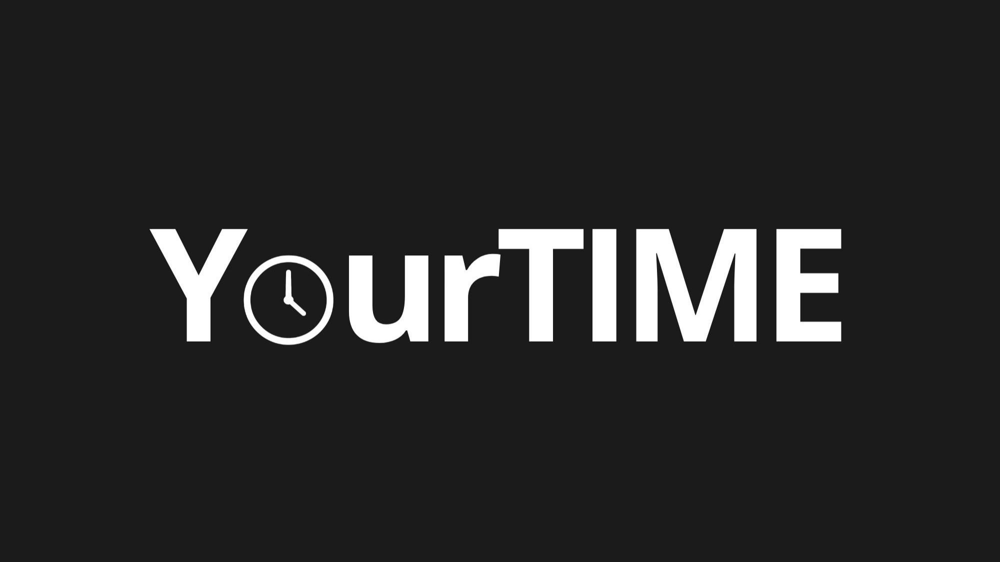
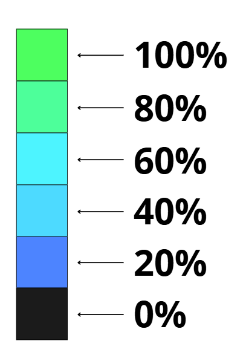

# Introduction

**YourTIME** is an advanced visual productivity and habit-tracking system designed for all types of users who want to take full control of their daily routines, optimize their time, and overcome procrastination. Unlike boring traditional to-do lists, this platform transforms discipline into an interactive and visual experience through a minimalist, dark-mode interface.

## Main Features and Operating Logic

- Smart Kanban Board (Activity Differentiation)
The daily workflow is managed through an interactive visual board with three classic columns: To-Do, In Progress, and Done. The system optimizes the interface by conceptually separating two types of workflows:

    1. Cyclical Habits: Recurring activities (e.g., reading for 25 minutes) that the user schedules for specific days of the week (e.g., every Monday and Tuesday). They have an automatic nightly reset system that, at midnight, checks for the new day, clears their status, and automatically returns them to the To-Do column. Habits that do not correspond to the current day are hidden to keep the board clean and free of clutter.

    2. One-Time Tasks: Specific tasks or pending items assigned for the current day or the following day (e.g., submitting a report). When moved to Done, they are permanently archived at the end of the day and do not return to the board.

- Automated and Real-Time Pomodoro Timer
Designed as the ultimate anti-procrastination tool, its operation is fully integrated with the user's actions:

    1. Drag Activation: By moving any card (habit or task) to the In Progress column, the system immediately activates a 25-minute automated focus block directly linked to that activity.

    2. Structured Work Cycle (25/5/30 Rule): When the 25-minute focus block expires, the timer automatically activates a short 5-minute break. After completing four consecutive focus blocks, the system grants a longer 30-minute break.
    3. Efficiency Metrics: If the user is highly efficient and moves the card to the Done column before the 25-minute timer expires, the system immediately validates the task, and that time is positively counted toward the heat map metrics, rewarding the user's speed.

- Visual Engine: Consistency Heat Map
Inspired by the activity grids of development platforms, this is the motivational and psychological core of the application. Each completed habit and focus interval illuminates an interactive annual chart on the screen.
Unlike traditional maps, this one has its own visual identity based on percentages of daily productivity achieved and transitions from dark tones to neon blues and greens:

  1. 0% (Inactive Day/No Logs): Dark Gray.

  2. 1% to 20% completed: Royal Blue.

  3. 21% to 40% completed: Sky Blue.

  4. 41% to 60% completed: Turquoise.

  5. 61% to 80% completed: Mint Green.

  6. 81% to 100% completed: Neon Green.

## Gamification Mechanics and User Experience (UX)

Streak Freeze Protection: A "shield" system (Duolingo style) that allows the user to protect their annual consistency on the heat map during difficult days, emergencies, or illness, avoiding the frustration of losing a perfect streak.
